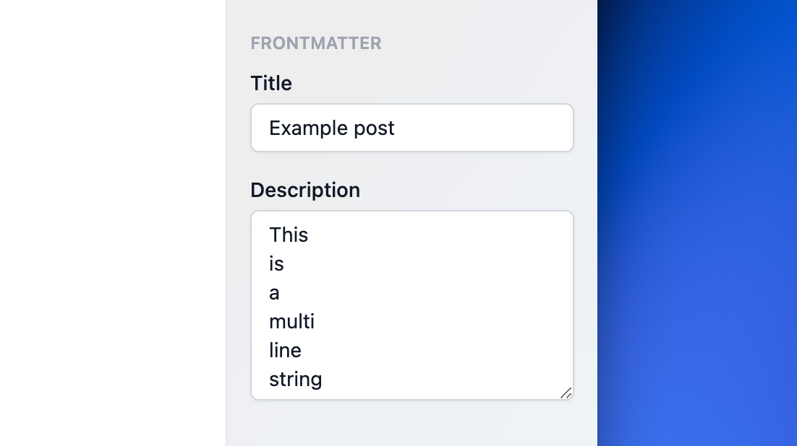

# Darkmatter SDK

> Enhance [Darkmatter](https://getdarkmatter.dev) integration with your [Astro](https://astro.build) website.

## Install

```sh
npm install --save-dev darkmatter-sdk
```

## Usage

### Define a multi-line text field

Use `text()` to define a text field that shows a textarea instead of a single-line input like `zod.string()` does.

`text()` returns the same [`ZodString`](https://zod.dev/?id=strings) object as `zod.string()`.

```js
import {z as zod, defineCollection} from 'astro:content';
import {text} from 'darkmatter-sdk';

const posts = defineCollection({
  schema: zod.object({
    title: zod.string(),
    description: text()
  });
});

export const collections = {posts};
```



### Define a date time field

Use `dateTime()` to define a date field that allows user to set the time, in addition to the date.

`dateTime()` returns the same [`ZodDate`](https://zod.dev/?id=dates) object as `zod.date()`.

```js
import {z as zod, defineCollection} from 'astro:content';
import {dateTime} from 'darkmatter-sdk';

const posts = defineCollection({
  schema: zod.object({
    title: zod.string(),
    date: dateTime()
  });
});

export const collections = {posts};
```


